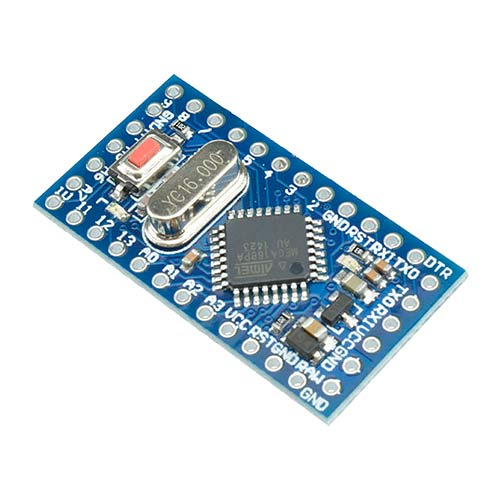

# [easiTM1637 Arduino Library](https://github.com/ilneill/easiTM1637)

This is a very simple Arduino Library to control the TM1637 (up to) 6-digit (+ decimal points) 7-segment LED display driver. 

The TM1637 is a small IC that can control up to six 7-segment LED display digits, each with an individually controlable decimal point. It also has a keyboard scan interface, but that feature is not supported by this library. It uses a 2-wire serial interface that initially appears similar to the I2C bus, but it is not I2C and the protocol is very different.

## Why... Why Indeed?

Another project I am working on (A Kim-1 Mega Emulator) has a lot of rabbit holes that I am compelled to go down.

One such rabbit hole is trying and testing libraries and hardware for some keypad input and LED/LCD output. I am mostly testing on an Arduino Mini Pro (it was what I had to hand), but I am also using an Arduino Mega (it was beside the Mini Pro). After a lot of research, none of the existing TM1637 libraries were ticking all the boxes for what I wanted to achieve, and how I wanted to achieve it. So, I decided to write my own library for the TM1637, doing exactly what I wanted, how I wanted it to be done, keeping it simple and without any unnecessary "features".

## Contents

1. [Library Features](https://github.com/ilneill/easiTM1637/#library-features)
2. [Library Installation](https://github.com/ilneill/easiTM1637/#library-installation)
3. [API Details](https://github.com/ilneill/easiTM1637/#api-details)
4. [TM1637 Chip Pinout](https://github.com/ilneill/easiTM1637/#tm1637-chip-pinout)
5. [A Common TM1637 Module](https://github.com/ilneill/easiTM1637/#a-common-tm1637-module)
6. [Example Hardware Build](https://github.com/ilneill/easiTM1637/#example-hardware-build)
7. [ToDo](https://github.com/ilneill/easiTM1637/#todo)
8. [References](https://github.com/ilneill/easiTM1637/#references)

## Library Features

This library uses manual bit banging for the serial communication protocol and implements several higher functions built on one that simply write bytes to the TM1637 device.

* Supports LED 7-Segment displays of up to 6 digits (+dps) using the TM1637.
* Supports the auto addressing and fixed addressing modes of the TM1637 chip.
* Has functions to easily display defined characters and 8, 12 and 16 bit numbers in decimal or hex digits.

## Library Installation

Currently the best (only) way you can install this library into your Arduino environment is manually from this repository.  

### Installing via this Repository 

First, you have to [download](https://github.com/ilneill/easiTM1637/archive/refs/heads/main.zip) this library in zip format. 

Then, unzip the easiTM1637-main.zip file into your Arduino Library folder. 

* On __Windows__: Documents\Arduino\libraries
* On __MAC OS__: ˜/Documents/Arduino/libraries
* On __Linux__: ˜/Documents/Arduino/libraries

## API Details

### Class definition:
__TM1637(uint8_t clkPin = 2, uint8_t dataPin = 3);__
* Create a TM1637 instance.

### Functions:
__void begin(uint8_t numDigits = 6, uint8_t brightness = 2);__
* Set up the display and initialise it with starting values. Returns nothing.

__void begin(uint8_t* tmDigitMap, uint8_t numDigits = 6, uint8_t brightness = 2);__
* Compile time dependent. Set up the display and initialise it with starting values. Returns nothing.

__void displayOff(void);__
* Turn the TM1637 display OFF. Returns nothing.

__void displayClear(void);__
* Clear all the digits in the display. Returns nothing.

__void displayBrightness(uint8_t brightness = 2);__
* Set the brightness (0x00 - 0x07) and turn the TM1637 display ON. Returns nothing.

__void displayChar(uint8_t digit, uint8_t number, bool raw  = false);__
* Display a character in a specific LED digit. Returns nothing.

__void displayInt8(uint8_t digit, uint8_t number, bool useDec = true);__
* Display a decimal integer between 0 - 99, or a hex integer between 0x00 - 0xff, starting at a specific digit. Returns nothing.

__void displayInt12(uint8_t digit, uint16_t number, bool useDec = true);__
* Display a decimal integer between 0 - 999, or a hex integer between 0x000 - 0xfff, starting at a specific digit. Returns nothing.

__void displayInt16(uint8_t digit, uint16_t number, bool useDec = true);__
* Display a decimal integer between 0 - 9999, or a hex integer between 0x0000 - 0xffff, starting at a specific digit. Returns nothing.

__void displayDP(uint8_t digit, bool status = false);__
* Turn ON/OFF the decimal point for the specified digit. Returns nothing.

### TM1637 Addressing Modes
The TM1637 uses addresses and enable lines (GRID1-GRID6) to uniquely identify and access each of the LED 7-Segment display digits.

* Logical digit 0 = Address 0x00
* Logical digit 1 = Address 0x01
* Logical digit 2 = Address 0x02
* Logical digit 3 = Address 0x03
* Logical digit 4 = Address 0x04
* Logical digit 5 = Address 0x05

The TM1637 chip supports 2 addressing modes and the mode that is used by the library is determined at compile time using a compiler definition in the "easiTM1637.h" file.

* if __USEADDRAUTOMODE__ is defined: Automatic address mode is used.
* if __USEADDRAUTOMODE__ is NOT defined: Fixed address mode is used.

#### Automatic
In this mode, the address to be used by the TM1637 for accessing the first digit is specified before the digit write, and is automatically incremented, after each digit write, to point to the next digit.

This is useful if the digits to be written to are in increasing sequential order.

#### Fixed
In this mode, the address to be used by the TM1637 for accessing each digit must be specified, before each digit write, to point to the digit that is to be written to.

This is useful if the digits to be written to are not in increasing sequential order. If, for example, the logical addressing of the TM1637 based display does not match the phyical layout, than this mode should be used. This concept is explained more below.

### TM1637 Logical to Physical Address Mapping
As alluded to earlier, the TM1637 uses addresses for each LED 7-Segment display digit.

In this library I have assumed that the lefthand digit is logical digit 0, and the righthand digit is logical digit 5. However, it may be that the physical layout of the digits, left to right is not the same as the logical addressing.

For instance, if the physical layout is such that logical digit 0, addressed by 0x00, is the righthand digit, and logical digit 5, addressed by 0x05, is the lefthand digit, then, without some translation, this library will actually display everything backwards. 

i.e. Trying to display "h12345" would actually look like "54321h" on such a display.

It might be that the logical and physical layouts are not simply reversed. When writing this library I discovered that my 6-digit TM1637 display had a reversed physical layout for each of the 3-digit blocks making up the 6 digits.

Physical digits = | 0 || 1 || 2 || 3 || 4 || 5 |

Logical digit 0 = Address 0x00 -> Physical digit 2\
Logical digit 1 = Address 0x01 -> Physical digit 1\
Logical digit 2 = Address 0x02 -> Physical digit 0\
Logical digit 3 = Address 0x03 -> Physical digit 5\
Logical digit 4 = Address 0x04 -> Physical digit 4\
Logical digit 5 = Address 0x05 -> Physical digit 3

To overcome this absurdity, I created a logical to physical mapping array, called __tmDigitMap__ to describe the physical location of each logical digit.

With my particular TM1637 display the __tmDigitMap__ array is {2, 1, 0, 5, 4, 3}.

Without the logical to physical mapping array, trying to display "012345" would actually display "210543". Notice how the untranslated display of "012345" gives the logical to physical mapping array that corrects (translates) the display!

As a consequence of the logical addressing not necessarily incrementing left to right with the physical digits, I had to introduce support for the TM1637 fixed address mode. This allows the address of each digit to be specified before it is written. Contrast this with automatic address mode where the address is only specified at the beginning and incremented automatically by the TM1637 after each digit write.

## TM1637 Chip Pinout

| DIP20 Package | 
|-------| 
| .png)| 

### Pin Descriptions of the TM1637 DIP20 Package

|Pin Label | Pin Number | Description |
|-------|-------|-------|
|GND| 1| GND - ground |
|SEG1/KS1| 2| Output (segment 1) |
|SEG2/KS2| 3| Output (segment 2) |
|SEG3/KS3| 4| Output (segment 3) |
|SEG4/KS4| 5| Output (segment 4) |
|SEG5/KS5| 6| Output (segment 5) |
|SEG6/KS6| 7| Output (segment 6) |
|SEG7/KS7| 8| Output (segment 7) |
|SEG8/KS8| 9| Output (decimal point) |
|GRID6| 10| Output (bit 6) |
|GRID5| 11| Output (bit 5) |
|GRID4| 12| Output (bit 4) |
|GRID3| 13| Output (bit 3) |
|GRID2| 14| Output (bit 2) |
|GRID1| 15| Output (bit 1) |
|VDD| 16| VCC - supply voltage |
|DIO| 17| Data input/output |
|CLK| 18| Clock input |
|K1| 19| Key scan data input 1 |
|K2| 20| Key scan data input 2 |

See the [datasheet](datasheets/TM1637-Datasheet.pdf) for more details.

## A Common TM1637 Module

The image below shows a relatively common 6-digit TM1637 based LED 7-segment display module.

| A 6-Digit TM1637 Display Module |
|-------|
|  |

## Example Hardware Build

Everything I have written has been tested using an Arduino Mega and an Arduino Mini Pro (ATmega168P) development board with an FT232 USB Serial adapter, and compiled using Arduino IDE v2.3.4.

This is the simple build I used while testing the [TM1637demo.ino](examples/TM1637demo/TM1637demo.ino) example with an Arduino Mega.

## ToDo

Is there anything? Let me know if you find a problem or think of any improvements!

## References 

My TM1651 Arduino library that this TM1637 library was built on:
 * https://github.com/ilneill/easiTM1651

The TM1637 Datasheet:
* [Titan Micro datasheet - TM1637](https://www.makerguides.com/wp-content/uploads/2019/08/TM1637-Datasheet.pdf)

And the **GOTO** Guide for Markdown Syntax:
* https://www.markdownguide.org/cheat-sheet/

*Enjoy!*

// EOF